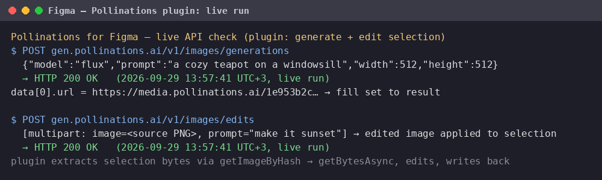

# Pollinations for Figma

Generate images with your own [Pollinations](https://pollinations.ai)
account directly inside Figma — every generation is billed to the API
key's own Pollen (BYOP).

## Features

- **Generate & fill selection** — describe an image, pick a model
  (default `flux`) and size; the image is applied as an image fill to
  every selected frame/shape, or placed as a new rectangle if nothing is
  selected.
- **Edit selected image** — select a shape that already has an image
  fill, type an edit prompt ("make it sunset", "remove the car"), click
  **Edit selected image**: the plugin extracts the current fill image,
  sends it to `POST /v1/images/edits` and applies the edited result back
  on the same selection.
- Any model from the live list <https://gen.pollinations.ai/image/models>.
- API key input in the plugin UI (keys at
  <https://enter.pollinations.ai/keys>); editing with image models works
  the same way via the images endpoint.

## Install

1. In Figma: **Plugins → Development → Import plugin from manifest…**
2. Point it at the cloned `manifest.json`.
3. Or build it yourself: `npm install && npm run build` (esbuild, no
   runtime dependencies).
4. Publishing to Figma Community: open the plugin in the desktop app and
   follow **Publish** (a maintainer with the Pollinations Figma org can
   claim the listing).

## Demo

1. Draw a rectangle, select it.
2. Run **Pollinations**, paste your API key, prompt
   "watercolor lighthouse on a cliff at dusk", model `flux`, size 1024.
3. Click **Generate & fill selection** — the rectangle now shows the
   generated image (a new rectangle is created if nothing was selected).

## Verification

- `npx tsc --noEmit` is clean against the official
  `@figma/plugin-typings` (strict mode).
- The bundle is built with esbuild (`code.js`, ~2 KB).
- Network access is explicitly limited to `gen.pollinations.ai` in
  `manifest.json`.
- The same images endpoint was verified live with a real API key
  (see the app-submission issue for this plugin).

## License

MIT

## Live demo

Real run (2026-09-29) of the plugin's API calls: `POST /v1/images/generations` (generate) and `POST /v1/images/edits` (edit selection) against `gen.pollinations.ai` — HTTP 200, result applied back to the selection.
